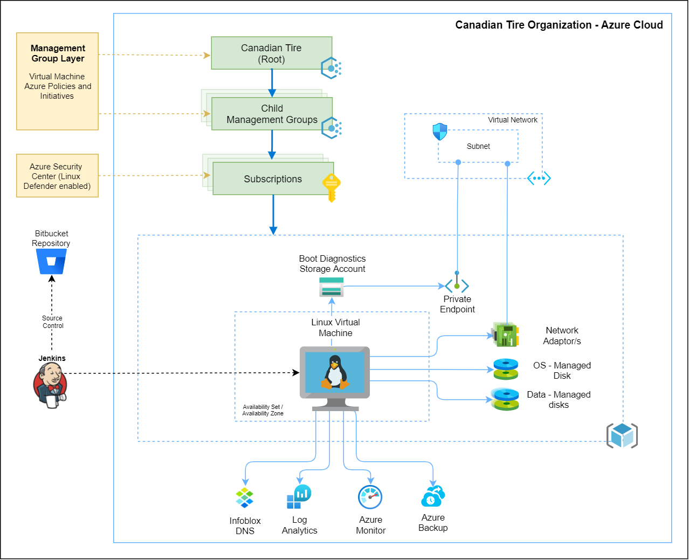

### Service Owner(s) - Cloud Operation & Automation Team

### Service Version: 0.1.0

### Overview:

An Azure virtual machine is an on-demand, scalable compute resource that is available in Azure. Virtual machines are generally used to host applications when more control over the computing environment is required compared to what is offered by other compute resources.

### Intake Processes:

| Name | Description |
|------|-------------|
| resource_group_name | The resource group name where the VM will be deployed. |
| domain_name | The Infoblox DNS domain name where the VM should be registered. Example `corp.azure.ctc`. |
| environment | Which enviroment `sandbox`, `nonprod`, `prod` |
| public_key | (Required) The Public Key which should be used for authentication, which needs to be at least 2048-bit and in ssh-rsa format.|
  

[Click here to view additional parameters ...](https://bitbucket.corp.ad.ctc/projects/EFTM/repos/terraform-azurerm-compute-linux/browse/README.md)

### Current Specs:

- Provisioned in Canada Central and Canada East
- CIS L1 and L2 marketplace base image
- Availability across Availability Zones or Availability Sets
- Support for Azure Backup integration
- Registers DNS entry to Infoblox
- Private access only (no public IP)
- Availability Set configured by default if no Availability Zones are defined
- BootDiag Storage account created per VM
- Supoort to deploy VM from CTC certified images

### Architecture Diagram:

### Technical Architecture:

- When multiple VMs are created to fulfil the same role (exemple Active Directory Domain Controllers), the VMs needs to be configured using separate Availability Zones (only supported in Canada Central)(SLA at least 99.99% of the time) or at least availability zones(SLA at least 99.95% of the time).
- The Linux VMs deployed must use marketplace CIS L1 OS as a minimum base image.
- The local admin username and ssh_key for accessing this VM are stored in Hasicorp Vault.
- A storage account is automatically created for each VM using the Azure Storage Account [module](https://bitbucket.corp.ad.ctc/projects/EFTM/repos/terraform-azurerm-storage-account/browse).
- Once the VM is deployed, it will automatically deploy [VM insights](https://docs.microsoft.com/en-us/azure/azure-monitor/vm/vminsights-overview) and starts collecting logs and metrics. The monitoring agents are deployed during the VM deployment, and Azure Policy audits and enforces the deployment of these monitoring agents.
- The VMs that are deployed to a subscription where Azure Security Center - Defender Plans is enabled, the agent for Linux Defender for endpoint is deployed automatically and is registerd with MCAS service.

### Security Architecture:

The Azure VM proposed is a reference design, where we are providing the guidelines to protect the Azure Service without the use of any specific scenario or application requirement.

Azure Virtual Machine (VM IaaS) provides on-demand, scalable computing resources by provisioning a Virtual Machine (VM). A Virtual Machine has CPU, memory, and disks and supports the same corporate tools and process currently in use and has additional support from Cloud capabilities available that are covered in this document. The VMs must be placed in a CTC Virtual Network to allow communication within CTC resources

This Security Architecture is only for VMs running in IaaS environment and does not apply to VMs created as part of PaaS (Platform as a Service) offering such as Kubernetes and Scale sets.

### Security considerations:

The CIA triad (Confidentiality, Integrity and Availability) are the initial three key areas to validate the Azure Virtual Machine Scale Sets, as follows:

Encryption in transit

- Microsoft uses two (2) layers of encryption for any given communication in their datacenters.

- An Azure IaaS VM requires the use of a Virtual Network to communicate with other VMs and Services

- Microsoft uses the Transport Layer Security (TLS) 1.2 protocol to protect data when it is traveling between the cloud services and customers infrastructure.

- There is an additional layer of encryption at the infrastructure layer. At the hardware level within the Azure Datacenter, Microsoft uses IEEE 802.1AE MAC (MACsec) from point-to-point communications.

  - It is built-in in the hardware and there is no penalty in latency and/or performance.

  - Customer does not need to configure anything, it is enabled by default.

  - It prevents physical “main-in-the-middle” attacks or snooping/wiretapping attacks

  - This security applies to communication within the same region or across regions

Encryption at rest

- All Managed Disks, Snapshots and Images which are components related to IaaS VMs are encrypted using Storage Service Encryption (SSE) using a Service Managed Key. This is done by default since June 10, 2017.

  - This encryption is known as Platform-managed Keys

  - The Platform-Managed Keys uses 256-bit AES encryption and it is FIPS 140-2 compliant.

- The use of Azure Disk Encryption (ADE) using Platform-Managed keys is required.

  - It uses either BitLocker (Windows) or dm-crypt (Linux) to encrypt the disks.

  - It integrates with Azure Key Vault and automatic rotation should be enabled.

  - Boot, data and temporary volumes must be encrypted as part of the process.

High Availability

- The use of at least two (2) VMs that share the same role (when applicable) is required to achieve high availability and meet the SLA requirements provided by Microsoft Azure.

- The use of Availability Zones is required when this feature is available in the region where the VM is being provisioned.

  - Availability Zones are connected by a high-performance network with a round-trip latency of less than 2 milliseconds, each Availability Zone has one or more datacenter with independent power, cooling and networking infrastructure within the same Azure region.

- The use of Availability Sets is required when Availability Zones are not supported in the region where the VM is being provisioned.

  - Availability Sets is a logical group of VMs within the same datacenter using the concept of update domain (up to 20) and fault domain (up to 3). A fault domain represents a common power source and network switch, an update domain represents VMs sharing the same hardware.

These additional security features will need to be configured as part of the Azure Site Recovery Services offer.

- All Azure VMs must be provisioned from Azure Marketplace using Operating Systems supported by EIS Team.

  - These images will have built-in configuration to support Azure Security Center and Defender products.

  - Microsoft Antimalware will be configured automatically.

- All VMs will be automatically provisioned into Azure Security Center as part of the provision process. This process will include Qualys scans to report and improve the overall security of the provisioned VMs.

- Azure Backup must be configured to protect VM workloads, the built-in solution supports both Linux and Windows platforms.

  - The Azure Backup and its security features are covered in the Azure Backup service offering.

- Currently, there is no BCDR (Business Continuity and Disaster Recovery) at this moment in Canadian Tire. No security requirement at this time and it will be updated when Canada East region becomes available to CTC Azure environment.

- Serial Console should be enabled to help troubleshooting VM access to the Operations Team. The use of this feature VM Contributor role or higher, and a PIM assignment for the operations team must be in-place.

- Boot Diagnostics must be enabled using managed storage account as part of the provisioning process.

- Currently the Azure Automation has not been certified, however, the Azure VM will benefit of this feature in the future by using these following features:

  - Enable Azure Change Tracking and Inventory to monitor software, windows services and linux daemons changes.

  - Enable Update Management to perform updates of Windows and Linux VMs and guarantee that VMs are being assessed and being updated automatically with all Critical and Security updates. //Configuration Manager right-now, current process doesn’t support continuous updates

  - Service Maps: Helping the Security and Operations Teams to understand the traffic patterns of any given Virtual Machine running in the Azure VM

### Security assumptions:

- Naming Convention to support the application on both datacenters. The naming convention should allow easy troubleshooting and comparison among datacenters.

- All standards defined in the Azure VM will be applied to the VMs in VMSS

- All additional Azure Services mentioned in this document will use their own approved Service Catalog at Canadian Tire to be deployed through Terraform.

- The same settings applied in production to Resource Groups, RBAC, Virtual Machines, Virtual Network and Network Security Groups should at least match in the secondary site (Canada East)

- Access review to this Azure resource must be performed regularly following CTC access review standard

- Azure Automation is not being supported in the production environment at Canadian Tire Corporation

- Use of only production feature at the time of writing. The use of Preview features is not supported in Canadian Tire environment.

- All current Canadian Tire standards for secret/certificate rotation must be performed by application owners when an automated solution is not available, or application does not have a built-in process to perform such tasks.

- Human access requests to this Azure resource instances must follow the defined CTC access process that includes business justification and required approvals (e.g. application owners).

### How to Use this Service:

- Use Azure Linux Virtual for any instances where an on-prmiese type of virtual machine is required in Azure: database clusters, active directory domain controllers, 3rd party application servers. 
- FQDN and address for the VM is provided. Dedicated IP address will be provided at the time of the provisioning and can be accessed by only in CTC network.
- Access the VM using the SSH protocol.

### Provisioning:

- Terrform workspace with all the required modules will be built and tested. 
- Once tested, the infrastructure will be provisioned as required in all required subscriptions and regions.

### Decommissioning:

-  Terraform to be leveraged for decommissioning required subscriptions and regions.

### Support Processes:

- All Azure metrics have a one-minute frequency, and each metric provides 30 days of history. You can configure alerts on the metrics. 
- Metrics for the guest operating system (guest OS) which runs in Azure Virtual Machines, Service Fabric, and Cloud Services are NOT listed here. Guest OS metrics must be collected through the one or more agents which run on or as part of the guest operating system. Guest OS metrics include performance counters which track guest CPU percentage or memory usage, both of which are frequently used for auto-scaling or alerting.

Host OS metrics are available and listed below. They are not the same. The Host OS metrics relate to the Hyper-V session hosting your guest OS session.

|Metric|Exportable via Diagnostic Settings?|Metric Display Name|Unit|Aggregation Type|Description|Dimensions|
|---|---|---|---|---|---|---|
|Available Memory Bytes|Yes|Available Memory Bytes (Preview)|Bytes|Average|Amount of physical memory, in bytes, immediately available for allocation to a process or for system use in the Virtual Machine|No Dimensions|
|CPU Credits Consumed|Yes|CPU Credits Consumed|Count|Average|Total number of credits consumed by the Virtual Machine. Only available on B-series burstable VMs|No Dimensions|
|CPU Credits Remaining|Yes|CPU Credits Remaining|Count|Average|Total number of credits available to burst. Only available on B-series burstable VMs|No Dimensions|
|Data Disk Bandwidth Consumed Percentage|Yes|Data Disk Bandwidth Consumed Percentage|Percent|Average|Percentage of data disk bandwidth consumed per minute|LUN|
|Data Disk IOPS Consumed Percentage|Yes|Data Disk IOPS Consumed Percentage|Percent|Average|Percentage of data disk I/Os consumed per minute|LUN|
|Data Disk Max Burst Bandwidth|Yes|Data Disk Max Burst Bandwidth|Count|Average|Maximum bytes per second throughput Data Disk can achieve with bursting|LUN|
|Data Disk Max Burst IOPS|Yes|Data Disk Max Burst IOPS|Count|Average|Maximum IOPS Data Disk can achieve with bursting|LUN|
|Data Disk Queue Depth|Yes|Data Disk Queue Depth|Count|Average|Data Disk Queue Depth(or Queue Length)|LUN|
|Data Disk Read Bytes/sec|Yes|Data Disk Read Bytes/Sec|BytesPerSecond|Average|Bytes/Sec read from a single disk during monitoring period|LUN|
|Data Disk Read Operations/Sec|Yes|Data Disk Read Operations/Sec|CountPerSecond|Average|Read IOPS from a single disk during monitoring period|LUN|
|Data Disk Target Bandwidth|Yes|Data Disk Target Bandwidth|Count|Average|Baseline bytes per second throughput Data Disk can achieve without bursting|LUN|
|Data Disk Target IOPS|Yes|Data Disk Target IOPS|Count|Average|Baseline IOPS Data Disk can achieve without bursting|LUN|
|Data Disk Used Burst BPS Credits Percentage|Yes|Data Disk Used Burst BPS Credits Percentage|Percent|Average|Percentage of Data Disk burst bandwidth credits used so far|LUN|
|Data Disk Used Burst IO Credits Percentage|Yes|Data Disk Used Burst IO Credits Percentage|Percent|Average|Percentage of Data Disk burst I/O credits used so far|LUN|
|Data Disk Write Bytes/sec|Yes|Data Disk Write Bytes/Sec|BytesPerSecond|Average|Bytes/Sec written to a single disk during monitoring period|LUN|
|Data Disk Write Operations/Sec|Yes|Data Disk Write Operations/Sec|CountPerSecond|Average|Write IOPS from a single disk during monitoring period|LUN|
|Disk Read Bytes|Yes|Disk Read Bytes|Bytes|Total|Bytes read from disk during monitoring period|No Dimensions|
|Disk Read Operations/Sec|Yes|Disk Read Operations/Sec|CountPerSecond|Average|Disk Read IOPS|No Dimensions|
|Disk Write Bytes|Yes|Disk Write Bytes|Bytes|Total|Bytes written to disk during monitoring period|No Dimensions|
|Disk Write Operations/Sec|Yes|Disk Write Operations/Sec|CountPerSecond|Average|Disk Write IOPS|No Dimensions|
|Inbound Flows|Yes|Inbound Flows|Count|Average|Inbound Flows are number of current flows in the inbound direction (traffic going into the VM)|No Dimensions|
|Inbound Flows Maximum Creation Rate|Yes|Inbound Flows Maximum Creation Rate|CountPerSecond|Average|The maximum creation rate of inbound flows (traffic going into the VM)|No Dimensions|
|Network In|Yes|Network In Billable (Deprecated)|Bytes|Total|The number of billable bytes received on all network interfaces by the Virtual Machine(s) (Incoming Traffic) (Deprecated)|No Dimensions|
|Network In Total|Yes|Network In Total|Bytes|Total|The number of bytes received on all network interfaces by the Virtual Machine(s) (Incoming Traffic)|No Dimensions|
|Network Out|Yes|Network Out Billable (Deprecated)|Bytes|Total|The number of billable bytes out on all network interfaces by the Virtual Machine(s) (Outgoing Traffic) (Deprecated)|No Dimensions|
|Network Out Total|Yes|Network Out Total|Bytes|Total|The number of bytes out on all network interfaces by the Virtual Machine(s) (Outgoing Traffic)|No Dimensions|
|OS Disk Bandwidth Consumed Percentage|Yes|OS Disk Bandwidth Consumed Percentage|Percent|Average|Percentage of operating system disk bandwidth consumed per minute|LUN|
|OS Disk IOPS Consumed Percentage|Yes|OS Disk IOPS Consumed Percentage|Percent|Average|Percentage of operating system disk I/Os consumed per minute|LUN|
|OS Disk Max Burst Bandwidth|Yes|OS Disk Max Burst Bandwidth|Count|Average|Maximum bytes per second throughput OS Disk can achieve with bursting|LUN|
|OS Disk Max Burst IOPS|Yes|OS Disk Max Burst IOPS|Count|Average|Maximum IOPS OS Disk can achieve with bursting|LUN|
|OS Disk Queue Depth|Yes|OS Disk Queue Depth|Count|Average|OS Disk Queue Depth(or Queue Length)|No Dimensions|
|OS Disk Read Bytes/sec|Yes|OS Disk Read Bytes/Sec|BytesPerSecond|Average|Bytes/Sec read from a single disk during monitoring period for OS disk|No Dimensions|
|OS Disk Read Operations/Sec|Yes|OS Disk Read Operations/Sec|CountPerSecond|Average|Read IOPS from a single disk during monitoring period for OS disk|No Dimensions|
|OS Disk Target Bandwidth|Yes|OS Disk Target Bandwidth|Count|Average|Baseline bytes per second throughput OS Disk can achieve without bursting|LUN|
|OS Disk Target IOPS|Yes|OS Disk Target IOPS|Count|Average|Baseline IOPS OS Disk can achieve without bursting|LUN|
|OS Disk Used Burst BPS Credits Percentage|Yes|OS Disk Used Burst BPS Credits Percentage|Percent|Average|Percentage of OS Disk burst bandwidth credits used so far|LUN|
|OS Disk Used Burst IO Credits Percentage|Yes|OS Disk Used Burst IO Credits Percentage|Percent|Average|Percentage of OS Disk burst I/O credits used so far|LUN|
|OS Disk Write Bytes/sec|Yes|OS Disk Write Bytes/Sec|BytesPerSecond|Average|Bytes/Sec written to a single disk during monitoring period for OS disk|No Dimensions|
|OS Disk Write Operations/Sec|Yes|OS Disk Write Operations/Sec|CountPerSecond|Average|Write IOPS from a single disk during monitoring period for OS disk|No Dimensions|
|Outbound Flows|Yes|Outbound Flows|Count|Average|Outbound Flows are number of current flows in the outbound direction (traffic going out of the VM)|No Dimensions|
|Outbound Flows Maximum Creation Rate|Yes|Outbound Flows Maximum Creation Rate|CountPerSecond|Average|The maximum creation rate of outbound flows (traffic going out of the VM)|No Dimensions|
|Percentage CPU|Yes|Percentage CPU|Percent|Average|The percentage of allocated compute units that are currently in use by the Virtual Machine(s)|No Dimensions|
|Premium Data Disk Cache Read Hit|Yes|Premium Data Disk Cache Read Hit|Percent|Average|Premium Data Disk Cache Read Hit|LUN|
|Premium Data Disk Cache Read Miss|Yes|Premium Data Disk Cache Read Miss|Percent|Average|Premium Data Disk Cache Read Miss|LUN|
|Premium OS Disk Cache Read Hit|Yes|Premium OS Disk Cache Read Hit|Percent|Average|Premium OS Disk Cache Read Hit|No Dimensions|
|Premium OS Disk Cache Read Miss|Yes|Premium OS Disk Cache Read Miss|Percent|Average|Premium OS Disk Cache Read Miss|No Dimensions|
|VM Cached Bandwidth Consumed Percentage|Yes|VM Cached Bandwidth Consumed Percentage|Percent|Average|Percentage of cached disk bandwidth consumed by the VM|No Dimensions|
|VM Cached IOPS Consumed Percentage|Yes|VM Cached IOPS Consumed Percentage|Percent|Average|Percentage of cached disk IOPS consumed by the VM|No Dimensions|
|VM Uncached Bandwidth Consumed Percentage|Yes|VM Uncached Bandwidth Consumed Percentage|Percent|Average|Percentage of uncached disk bandwidth consumed by the VM|No Dimensions|
|VM Uncached IOPS Consumed Percentage|Yes|VM Uncached IOPS Consumed Percentage|Percent|Average|Percentage of uncached disk IOPS consumed by the VM|No Dimensions|
|VmAvailabilityMetric|Yes|VM Availability Metric (Preview)|Count|Average|Measure of Availability of Virtual machines over time. Note: This metric is previewed to only a small set of customers at the moment, as we prioritize improving data quality and consistency. As we improve our data standard, we will be rolling out this feature fleetwide in a phased manner.|No Dimensions|

### Monitoring / Incident Alerting / Escalation Process:

- Check the [Azure Status Board](https://status.azure.com/en-us/status) for Azure Virutal Machines to see if this is a known issue that Microsoft is actively working to resolve.

| Metric/Events                                     | Target                  | Response Process    | Threshold |
|---------------------------------------------------|-------------------------|---------------------|-----------|
|Azure Linux VM  Availability                       |NOI                      |Incident management  |TBD        |
|Unauthorized Access                                |SIEM                     |SOC / Telus          |TBD        |
|Deletion of VM or compnents                        |NOI                      |Incident management  |TBD        |
|Metrics listed above in troubleshooting            |MariaDB Metrics          |Incident management  |TBD        |

### Security Monitoring:

-  All logging and alerts that are recommended as part of the Security Architecture for all Azure services is kept in a spreadsheet which is updated as part of the lifecycle process of the solutions.
[Click here to access the complete list of policies](https://cantirecorp.sharepoint.com/:x:/s/COA/ETgD6OTQ6NVKop-w_8Qb_yMB2hHZpyr9MO2iUyjzJyPu2g?e=DFz0zp)

### Backup Policy:

- Backup policy as specified by the project.

### High Availability (HA) and Disaster Recovery (DR):

The Linux Virtual Machine as a standalone service does not support HA. In order achive this functionality, multiple instances of the same VM and application needs to be deployed in either Availability Zones (only supported in Canada Central)(SLA at least 99.99%) or at least availability sets (SLA at least 99.95%).

Similar to an on-premises VM, the Azure Linux VM does not have DR feature built-in as part of the service construct and it will require a creation of a mirrored environment in a different region with a solution to route and redirect traffic among regions.

These additional security features will need to be configured as part of the Azure Site Recovery Services offer.

-  Use of ephemeral disks is highly recommended if the application supports it. 
-  OS Images must be approved by Canadian Tire support team and meet the security requirements that are being used to deploy VMs in Microsoft Azure. 
-  Application Health Monitoring feature is required when using Automatic OS Upgrades. This configuration must be done based on the nature of the application(s) running on the VMSS (protocols, ports and etc). 
-  Boot Diagnostics must be enabled using a Storage Account to be provisioned as part of the VM deployment. 

### Troubleshooting:

- Due to the indepth nature of different issues that can arise from Virtual Machines, check the [offical documentation from Microsoft](https://docs.microsoft.com/en-us/troubleshoot/azure/virtual-machines/welcome-virtual-machines)

### To Do's:

- Security Architecture
- Security Assumptions
- Security Monitoring

### Realted Links:

- [Linux virtual machines in Azure - Azure Docs](https://docs.microsoft.com/en-us/azure/virtual-machines/linux/overview)
- [View TF Module](https://bitbucket.corp.ad.ctc/projects/EFTM/repos/terraform-azurerm-compute-linux/browse)