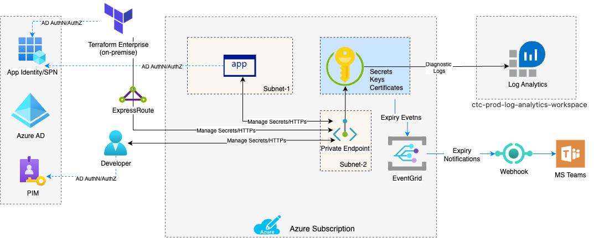
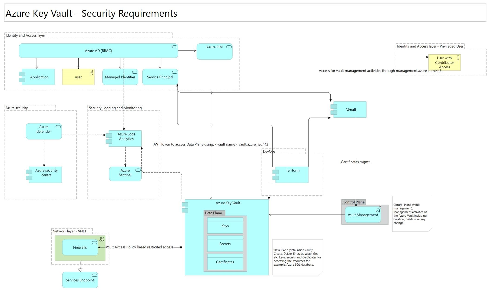

### Service Owner - Cloud Operations & Automation Team 

### Service Version - 4.2.0

 ### Service Overview

**Azure key vault** is the Azure native offering for keys and secrets management.  Azure Key Vault can be used to Securely store and tightly control access to tokens, passwords, certificates, API keys, and other secrets.  Azure Key Vault helps solve the following problems:

* **Secrets Management** - Azure Key Vault can be used to Securely store and tightly control access to tokens, passwords, certificates, API keys, and other secrets

* **Key Management** - Azure Key Vault can be used as a Key Management solution. Azure Key Vault makes it easy to create and control the encryption keys used to encrypt your data.

* **Certificate Management** - Azure Key Vault lets you easily provision, manage, and deploy public and private Transport Layer Security/Secure Sockets Layer (TLS/SSL) certificates for use with Azure and your internal connected resources.

### Architecture Diagram

> 

### Technical Architecture and Current Offering

* Private access is secured using a private endpoint.  
* Can be provisioned in Canada Central and Canada East
* Policies allow secrets, tokens and keys to be stored into Key vault.
* Soft delete and Purge protection is enabled by default for all AKV instances.
* In addition to base provisioning, the terraform module provided by COA offers the following capabilities:
  * Import certificates to store them in Azure Key Vault
  * Generate new certificates and store them in Azure Key Vault
  * Create and store secrets and keys
* Secrets and Keys should be created using Infrastructure as Code with Terraform. The current module allows to add/remove secrets and keys. COA also offer another module named _terraform-azurerm-keyvault-secret_ which allows teams to add secrets to an exisitng AKV instance. It's highly recommended to only use one of these certified methods to manage secrets and keys as they enforce setting expiry dates on credentials, which if not done will trigger security audit policies.
* COA terraform module for AKV enables the integration with Event Grid which allows users to be notified when the status of a secret stored in key vault has changed. A status change is defined as a secret that is about to expire (30 days before expiration), a secret that has expired, or a secret that has a new version available. Notifications for all three secret types (key, certificate, and secret) are supported. Webhooks (e.g. Microsoft Teams webhook) is the only supported notification channel with the current AKV terraform release and it's the user's responsibility to create a webhook and provide it at provisioning time.
* COA terraform module for AKV supports either Key Vault Policies or RBAC. In additon, configuring a mix of vault policies and RBAC policies is also supported to accommodate some corner use cases.

### Security Architecture

* The Azure Key Vault can address common security problems, such as secrets, keys and certificate management for applications/workloads running in Microsoft Azure. The service natively integrates with other Microsoft Services, supports centralized logging, and has built-in RBAC (Role-Based Access Control) access.

* The goal is to have at least one (1) Azure Key Vault per application provisioned in the Canadian Tire Azure environment. However, it is acceptable and supported to use several key vaults to segregate information for complex applications and different types of access (private links vs firewall).

### Security considerations

(1). **Focus on the CIA triad** (Confidentiality, Integrity and Availability) and some essential security features available as part of this offering-

(1.1) *Encryption in transit*

* Secure Transfer (TLS) must be enabled during the provisioning
* TLS 1.2 must be configured and enforced by the clients accessing the Key Vault

(1.2)  *Encryption at rest*

* Azure Key Vault provides two types of resources to store and manage cryptographic keys: software-protected Vaults or HSM-Protect (Hardware Security Module) Keys.
* The use of Software-Protected Vaults is the default option when not using critical data
* When using critical data, the use of Managed HSM is recommended because it provides single-tenant and zone-resiliency. This option is not supported by the current release, if required, please reach out to the COA team.

(1.3) *Key Rotation*

* According to Enterprise Encryption Standard Section 4.8.7, the maximum expiry timeframe for keys, secrets, and certificates stored in AKV should not exceed 24 Months.

(2). **High Availability**

* The contents of any given key vault are replicated within the region and to a secondary region at least 150 miles away. The process is automatic and does not require configuration.

(3). **Access Controls**

* Policies should be created to access secrets and/or keys.
* All AKV instances should be protected and follow the principle of least privilege utilizing Azure RBAC to control access.
* Access to AKV administrative roles should utilize Azure PIM with a maximum assignment of 4 hours and also require MFA
* Service Principals should have the least privilege possible to perform their necessary functions on Azure Key Vault Resources. Input variable object_id is required at provisioning time and should be the object ID of an AAD security group that is given access to the vault (only Applications' SPNs should be added to this AD group, Individiual users are required to use PIM should they need access to AKV)

### Authenticate to Key Vault in code
Key Vault uses Azure Active Directory (Azure AD) authentication, which requires an Azure AD security principal to grant access. An Azure AD security principal can be a user, an application service principal, a managed identity for Azure resources, or a group of any of these types.

### Authentication best practices
We recommend that you use a managed identity for applications deployed to Azure. If you use Azure services that don't support managed identities or if applications are deployed on-premises, a service principal with a certificate is a possible alternative. In that scenario, the certificate should be stored in Key Vault and frequently rotated.

We recommend these security principals in each environment:
* **Production environment:** Managed identity or service principal with a certificate.
* **Test and development environments:** Managed identity, service principal with certificate, or service principal with a secret.
* **Local development:** User principal or service principal with a secret.

### Azure Service Security

* Azure Security Center Defender for Azure Key Vault must be enabled at the subscription level
* The standard is to use private links to pin down the Azure Key Vault to the Virtual Network in use by the application
* The use of private endpoints and firewalls to allow only the required traffic must be configured during provision time
* The use of a Firewall without private links is supported, however, only when the private link feature cannot be used due to the application limitations. The use of a second key vault can be used to segregate the type of access of the key vault information.
* The feature Microsoft services to bypass the firewall restriction should be enabled to allow other trusted Microsoft services to be able to leverage Azure Key Vault capabilities, for PaaS to PaaS (where supported)
* Azure Key Vault supports either Key Vault Policies or RBAC. 
* The recommendation is to use RBAC policies with buit-in roles whenever possible:
  * Roles should be associated with Azure AD/Active Directory groups following a proper naming convention
  * All privileged groups must be monitored, and changes must be tracked in the SIEM solution
  * In some cases, managed identities and service principals may be configured by themselves 
  * The use of custom roles is not recommended and should be avoided
* All Azure Key Vault objects (secrets and keys) that do not have automatically renew must have an expiration date configured. Alerts will be triggered when the objects expire.
* Venafi is currently in use and it will be responsible to manage certificate requests and renew as part of the provisioning process, besides permission to Venafi, there is no additional configuration required in the Azure Key Vault to manage certificates.
  * Venafi must ensure that the Certificate Transparency feature is enabled for all Azure Key Vault SSL/TLS certificates to adhere to web security best practices
* The soft delete should be enabled as part of the provisioning process. The retention should be configured at least for thirty (30) days
* The Purge protection should be configured
* Canadian Tire does not support the use of self-signed certificates in Azure Key Vault in production and non-production subscriptions. An alert will be generated for self-signed certificates being created in those environments

### Azure Key Vault RBAC Roles guidance

When using RBAC Policies, these are the default roles and possible candidates to be assigned during a lifecycle of a new or existent application running in Microsoft Azure.

|Roles  | Description | Candidate for the role |
|------|-------------|------------------------|
| Key Vault Administrator | Perform all data plane operations on a key vault and all objects in it, including certificates, keys, and secrets. Cannot manage key vault resources or manage role assignments.||
| Key Vault Certificates Officer | Perform any action on the certificates of a key vault, except manage permissions. | Venafi Service Principal Account| 
| Key Vault Crypto Officer  | Perform any action on the keys of a key vault, except manage permissions.||   
| Key Vault Crypto Service Encryption User  | Read metadata of keys and perform wrap/unwrap operations.||   
| Key Vault Crypto User  | Perform cryptographic operations using keys.  | Application Accounts |
| Key Vault Reader  | Read metadata of key vaults and their certificates, keys, and secrets. Cannot read sensitive values such as secret contents or key material.|   N/A|
| Key Vault Secrets Officer | Perform any action on the secrets of a key vault, except manage permissions. |  N/A |
| Key Vault Secrets User | Read secret contents.  | Application Accounts|

### Security Integration

The Azure Key Vault service integration points with other Azure services and Canadian Tire resources.
* Terraform is the tool to perform provisioning and DevOps integrations
* Virtual Network and Subnets where the service will be placed (private link)
* Event Grid: all objects (certificates, keys and secrets) that are about to expire will generate an alert in the backplane and that information will trigger an alert using Event Grid to alert operations and owners.
* PIM (Privileged Identity Management) will be used to authenticate regular Canadian Tire administrators in the Azure Control Plane to manage this service. A complete process to review RBAC permissions to Azure Key Vault has to be part of that solution.

### Azure Policies

* Canadian Tire Corporation uses CIS, Azure Security Benchmark and CTC Baseline custom initiative policies assigned at the Management Group (Landing Zone and Platform) which comprehends most of the subscriptions used by production and non-production.
* All Azure Policies covered by CIS Microsoft Azure Foundation Benchmark will be automatically applied to the resources and actions will be taken as part of the operation process.
* All Azure Policies recommended as part of the Security Architecture for all Azure services are kept in a spreadsheet which is updated as part of the lifecycle process of the solutions. Click here (https://cantirecorp.sharepoint.com/sites/COA/Shared%20Documents/SecurityDocs) to access the complete list of policies.

### Security Assumptions

* Naming Convention to support the application on both datacenters. The naming convention should allow easy troubleshooting and comparison among datacenters.
* All additional Azure Services mentioned in this document will use their own approved Service Catalog at Canadian Tire to be deployed through Terraform.
* The same settings applied in production to Resource Groups, RBAC, Virtual Machines, Virtual Network and Network Security Groups should at least match in the secondary site (Canada East)
* Access review to this Azure resource must be performed regularly following the CTC access review standard
* Azure Automation is not being supported in the production environment at Canadian Tire Corporation
* Use of only production/GA features at the time of writing. The use of Preview features is not supported in the Canadian Tire environment.
* All current Canadian Tire standards for secret/certificate rotation must be performed by application owners when an automated solution is not available, or the application does not have a built-in process to perform such tasks. 
* Human access requests to this Azure resource instance must follow the defined CTC access process that includes business justification and required approvals (e.g. application owners).

### Logging and Alerts

* All logging and alerts that are recommended as part of the Security Architecture for all Azure services are kept in a spreadsheet that is updated as part of the lifecycle process of the solutions. Click here (https://cantirecorp.sharepoint.com/sites/COA/Shared%20Documents/SecurityDocs) to access the complete list of Logging and Alerts.

### How to use this service

* Rest API call is made to access the Key vault to access the secrets and keys.
* FQDN and address for the Key vault are provided. A dedicated IP address will be provided at the time of the provisioning and can be accessed only in the CTC network.
* Apps could retrieve secrets and keys from Key Vault in a lot of different ways. Eg: Rest, .NET, Java, Node.js, Python, Azure CLI and Azure PowerShell.

### Provisioning

* Provision of a Key Vault is the default when deploying a new Resource Group.

* It will be triggered through Terraform with the following key parameters-

| Input | Description |
|------|------------|
| input\_brand | Default brand name |
| input\_cost_center  | Share the cost center for tagging resource |
| input\_environment | Which enviroment, sandbox, nonprod or prod for gen1 deployments. Gen2 deployments use unique env name. |
| input\_location | Specify the Azure location where the keyvault service should exist. Changing this forces a new resource to be created |
| input\_location\_code | Mention location code (cc or cc) |
| input\_instance\_number | instance number of azure keyvault. |
| input\_project\_name | Project name. |
| input\_project_code | Share the project code for tagging resource |
| input\_resource\_group\_name | The name of the resource group. |
| input\_sku\_name | The Name of the SKU used for this Key Vault. |
| input\_tenant\_id | Tenant id. |

[Click here to view additional parameters, you need BitBucket access to view this file](https://bitbucket.corp.ad.ctc/projects/EFTM/repos/terraform-azurerm-keyvault/browse/README.md)

*Please note*- Storage account access, key vault access will be programmatically configured for this module.

### Provisioning (Gen2)

* Input variable environment is required and should be a unique env name (i.e. not prod/non-prod/sandbox/infra)
* Input variable object_id is required and is the object ID of an AAD security group that is given access to the vault (only Applications' SPNs should be added to this AD group, Individiual users are required to use PIM should they need access to AKV)

### Decommissioning

* Decommissioning will be triggered through Terraform.

### Support processes

* Key related process (access to the secrets and keys could be rotated)
* Creation of secrets and keys (could be requested and provisioned programmatically)
* Recovery of Soft deletion (Soft delete, 90 days)
* Recovery of Purge (Purge protection, 90 days)

### Monitoring / Incident Alerting / Escalation process

| Metric/Events                                     | Target                  | Response Process    | Threshold |
|---------------------------------------------------|-------------------------|---------------------|-----------|
|Key Vault Availability                             |NOI                      |Incident managementTo|TBD        |
|Unauthorized Access                                |SIEM                     |SOC / Telus          |TBD        |
|Delete the Key Vault Resource, secrets, or keys.   |NOI                      |Incident management  |TBD        |
|Service Api Latency                                |Key Vault Metrics        |Informational only   |           |
|Service Vault Availability                         |Key Vault Metrics        |Informational only   |           |

### Backup Policy

* Versioning/Soft delete/Purge protection is enabled by default for all AKV instances.

### High Availability (HA) and Disaster Recivery (DR)

The contents of Azure key vault are replicated within the region and to a secondary region at least 150 miles away (Canada-Central and Canada-East). If individual components within the key vault service fail, alternate components within the region step in to serve requests to make sure that there is no degradation of functionality In the rare event that an entire Azure region is unavailable, the requests in that region are automatically routed (failed over) to a secondary region. DR and HA of AKV is completely managed by Microsoft and transpartent to Canadian Tire users. 

### Troubleshooting

* Lost access due to network, secrets and keys
* Review access logs & perform a Trace route
* Lost access due to secrets and keys
* Review access logs to determine if the keys are expired.

### Related Links:

* [Azure Keyvault](https://docs.microsoft.com/en-ca/azure/key-vault/general/overview)
* [Azure Keyvault Developer's Guide](https://docs.microsoft.com/en-us/azure/key-vault/general/developers-guide)