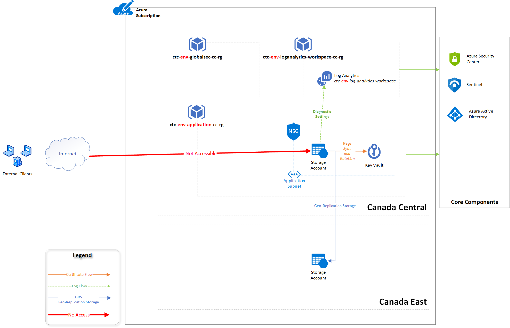

### Service Owner - Cloud Operations & Automation Team 

### Service Version: 5.4.2

### Current Offering

* We currently offer regular Blob storage

### Service Overview

***Storage Account*** provides a unique namespace for your Azure Storage data. The current offering supports Blob, File, Queue, and Table Storage.  Data in your Azure storage account is durable and highly available, secure, and massively scalable. Access is provided only through HTTPS 

### Current specs

* Non-critical application(s)
* Private access only (no public IP)
* Restricted data allowed
* Programmatic access to storage blob only
* Access Tier (hot and cold)
* SaaS token access (where applicable)

### Architectural Overview

<The diagram would need to include CTC DNS name, access path, key storage location, subscription> 

### Detail Design

* A storage account which is created by default with the provisioning of a resource group
* The current offering supports the Hot storage tier only.
* Based on business criticality, blob storage is provisioned with Local Redundancy (LRS tier - 99.9% availability) in Canada Central
* Private access is secured using a private link to ensure data stays within the CTC network
* 2 SAS access keys are generated by default upon provisioning of a storage account.  The default keys have full access to perform all operations on the storage account.  Restricted SAS tokens can be generated to lock down access to specific operations or access only.
* SAS tokens are generated and stored as secrets in the Resource Group key vault. 
* Blob Soft delete is available for 7 days. 

### Security Architecture

The Storage Account security can be represented in the following diagram, the security features being applied in this Azure Service covers the basic security requirements, however, Canadian Tire and future applications may require additional changes to meet new security requirements based on specific use scenarios that may be required by specific projects. Storage Accounts will be created at the Resource Group level and they will be created to fulfill application/service requirements. The Storage Account(s) will use Azure Key Vault to manage the keys. All diagnostic settings information will be sent to a Log Analytics workspace which can be consumed by Security Tools.
 

As part of the Security Architect of this new Azure Service, these following items will focus on the CIA triad (Confidentiality, Integrity, and Availability) and some essential security features available as part of this offering.

* Encryption in transit
  * Secure Transfer (TLS) must be enabled during the provisioning
  * TLS 1.2 must be configured and cannot be downgraded
* Encryption at rest
  * Data Encryption must be encrypted using Canadian Tire managed keys (the encryption key will be auto-rotated every year) where PII data is being stored
  * The encryption and decryption is transparent and uses 256-bit AES encryption, and it is FIPS 140-2 compliant
* High Availability
  * For single regions deployments that require high availability the use of ZRS (Zone-Redundant Storage) is acceptable. Three synchronous copies across three (3) different data centers within the region. If not available, then LRS.
  * For multiple regions and critical data workloads, the use of GZRS (Geo-Zone-Redundant Storage) is the recommended approach. The GZRS is not available in Canada East, then the RA-GRS is the best available option.
  * The keys must be rotated every year and stored in the [Corporate Vault solution], the recommendation is to renew the primary key and secondary key in different cycles (at least 6 months apart) to avoid application access problems.
  *  Microsoft has an SLA of 99.9% for ZRS and GZRS.

### Azure Service Security

* Access to Storage Accounts should use Managed Identities that can be provisioned and assigned using IaC (Infrastructure as Code) for all cloud applications and resources running in Microsoft Azure
* For applications that are running outside of Azure or that don't have support for Managed Identities, then the use of Shared Access Signatures (SAS) are recommended. The SAS tokens are used to provide delegated access to resources in the Storage Account. The SAS keys can be assigned to specific services (blob, queue, table, or file), a specific duration of the SAS, protocols, and actions allowed.
  * The application dictates the best time for a SAS token.
  * If there is no requirement from the application side. The recommendation is to use for one (1) hour which is suitable for the vast majority of cloud applications that do not require extensive access to the storage account in a single operation.
* The use of access keys is not recommended, but they can be used as a last resort. If the application requires the use of access keys, then it should use the Key Vault that is being provisioned in the same Resource Group to retrieve the information and access the required secret.
* The Storage Account keys will be protected in Azure Key Vault and Hashicorp Vault.
* Use Key Vault Managed Storage Account which synchronizes and rotates automatically
   * A new role Storage Account Key Operator Service will be created in the Storage Account resource, which will allow the Key Vault to access it to manage the required keys -The rotation period for the access keys must be configured as seven (7) days for restricted and confidential data and Canadian Tire standards for internal data.
   *  Azure Key Vault can be used to store and generate SAS tokens.   
* The following security features must be enabled:
  * Enable Secure Transfer required
  * Disable Allow blob public access
  * Set Minimum TLS Version to 1.2
  * Shared Access Signature (SAS) allowed protocols set to HTTPS only
  * Soft delete features (blobs, containers and, etc) should be enabled for at least 7 days
  * Disable Static website.
  * Tracking features such as versioning should be enabled based on the relevance of the data.
* Azure Defender for Storage Accounts should be enabled at the Subscription level in Azure Security Center.

### Security Integration

The Storage Account service has some integration points with other Azure services and Canadian Tire resources.
* PIM (Privileged Identity Management) will be used to authenticate regular Canadian Tire administrators in the Azure Control Plane to manage this service.
* Azure Key Vault service will be used to automatically rotate the Storage Account keys and SAS requests.
* Terraform will be used to deploy the new Storage Account resources.
* Virtual Network and Subnets where the Storage Account will be placed (private link).

### Network Security

* The standard is to use private links to pin down the Storage Accounts to a Canadian Tire Virtual network
  * Some services do not support a private network, e.g: Storage Accounts being used as Boot Diagnostics for IaaS VMs.
* If there is a requirement that does not allow private endpoints, then the use of service endpoints should be the second-best option.
* Use Storage Firewall where the application owner can define a specific virtual network/subnet (by default is empty) or an IP Address range (by default the IP range of the on-premises datacenters, which are 196.54.42.236/30 and 196.54.42.232/30).   
    * The firewall rule should allow Microsoft services to access the storage account.

### Azure Policies

Some of the security recommendations can be enforced through Azure Policies, which will automatically force the provision of Azure Resources following the Security Standards defined in this document.   
These are the recommended Azure Policies to be enabled at either Subscription/Management Group level to evaluate and help the provision of a more secure Storage Account:   

| Policy | Recommended Value | 
| ------ | ----------------- |
| Deploy Advanced Threat Protection on Storage Accounts | DeployIfNotExists |
| Secure transfer to storage accounts should be enabled | Audit |
| Storage account public access should be disallowed    | Audit |
| Storage account should use a private link connection  | AuditIfNotExists |
| Storage accounts should restrict network access       | Audit |    
[Click here to access the complete list of policies](https://cantirecorp.sharepoint.com/sites/COA/Shared%20Documents/SecurityDocs/GRC%20MS%20Azure%20Security%20Policy%20Tracking%20v1.0.xlsx)

### Diagnostic Settings

* The **AuditEvent** log category must be configured to send the diagnostic settings to the Log Analytics managed by the Security Team

### Security Alerts

These following events should be logged and monitored accordingly-
*  Approve Private Endpoint Connections
|  AzureActivity : where _ResourceId contains "networkInterfaces/PrivateLinkResource.nic" and ActivityStatus contains "Succeeded"
* Private Link Dns Zone activity log
|  AzureActivity : where OperationNameValue contains "Microsoft.Network/privateEndpoints/privateDnsZoneGroups/write" and ActivityStatus has "Succeeded"
*  Create/Update Storage Account from non-Terraform accounts
|  AzureActivity : where OperationNameValue contains "Microsoft.Storage/storageAccounts/write" and Caller !contains "Terraform"
|  AzureActivity	 : where OperationNameValue contains "Microsoft.Storage/storageAccounts/write" and Caller contains "UserName"
*  Delete Private Endpoint Connection
|  AzureActivity : where OperationNameValue contains "Microsoft.Network/privateEndpoints/delete" and ActivityStatus has "Succeeded"
|  AzureActivity : where OperationNameValue contains "Microsoft.Network/networkInterfaces/delete" and HTTPRequest contains "DELETE" and ActivityStatus has "Succeeded"
*  Delete Storage Account
|  AzureActivity : where OperationNameValue contains "Microsoft.Storage/storageAccounts/delete" and Caller !contains "Terraform"
|  AzureActivity : where OperationNameValue contains "Microsoft.Storage/storageAccounts/delete" and Caller contains "UserName"
*  Delete Storage Account Management Policies
|  AzureActivity : where OperationNameValue contains "Microsoft.Storage/storageAccounts/managementPolicies/write" and ActivityStatus has "Succeeded" and HTTPRequest has "PUT"
*  List Storage Account Keys
|  AzureActivity : where OperationNameValue contains "Microsoft.Storage/storageAccounts/listKeys/action" and ActivityStatus has "Succeeded"
*  List Access Keys
|  AzureActivity : where OperationNameValue contains "Microsoft.Storage/storageAccounts/listKeys/action" and ActivityStatus has "Succeeded"
*  Regenerate Storage Account Keys
|  AzureActivity : where OperationNameValue contains "Microsoft.Storage/storageAccounts/regenerateKey/action" and ActivityStatus has "Succeeded"
*  List Account SAS
|  AzureActivity : where OperationNameValue contains "Microsoft.Storage/storageAccounts/listAccountSas/action" and ActivityStatus has "Succeeded"
*  Configuration changes
|  AzureActivity : where OperationNameValue contains "Microsoft.Storage/storageAccounts/write" and ActivityStatus has "Succeeded" and HTTPRequest has "PUT"

### Azure Automation

* No automation in the current service release is required

### Security Assumptions

*  Access keys to be rotated regularly following CTC standards for secret rotations (1 year).
*  Access review to this Azure resource must be performed regularly following CTC access review standard.
*  Human access requests to this Azure resource instances must follow the defined CTC access process that includes business justification and required approvals (e.g. application owners, Redis service owners).
  
### How to use the service?

* Storage accounts can be used to store unstructured data.  Use cases include 
	* Serving images or documents directly to a browser.
	* Storing files for distributed access.
	* Streaming video and audio.
	* Writing to log files.
	* Storing data for backup, restore, disaster recovery, and archiving.
	* Storing data for analysis by an on-premises or Azure-hosted service.
* Upon provisioning, an FQDN and IP address for the blob storage is provided. Access to the storage account is allowed from the CTC network only.
* To access the storage account data, use the Key Vault Rest API to retrieve the SAS token, then utilize it to access the blob storage.    

### Provisioning

* Via Terraform  

| Variable Name   | Value                      |
|-----------------|----------------------------|
| environment     | sandbox (example)          |
| project_name    | odp (example)              |
| is_hns_enabled  | true or false              |
| container names | blob1, blob2 (example)     |

[Click here to view additional parameters, you need BitBucket access to view this file](https://bitbucket.cantire.com/projects/EFTM/repos/terraform-azurerm-storage-account/browse/README.md)

### Decommissioning

* Via Terraform

### Support processes

* Key related process (generation & expiry)

* Default SAS token regeneration
1. Navigate to the desired storage account for key re-generation
2. Select Access Keys from the left navigation panel
3. Select the Refresh Icon beside the key to be regenerated.  Important – Access will be revoked for any user/application using this Key and delegate SAS tokens created using this key.

* Custom SAS token generation
1. Navigate to the desired storage account for SAS token generation
2. Select Shared Access Signature from the left navigation panel
3. Select the permissions for the SAS token and click on generate SAS token and connection string
	a.	Allowed Services – Blob (this is the only service offered at this time
	b.	Allowed Resource type – select either object level or container level
	c.	Allowed permissions – select as required
	d.	Start and expiry date/time - Select the token start and expiry dates – note that tokens cannot be revoked once issued without regenerating the access keys which would impact all tokens
  e.  Allowed IP addresses - Enter allowed IPs if applicable
	f.	Allowed Protocols - Select HTTPS only 
	g.	Signing key - Select the signing key used for this token (if this key is regenerated the associated token is revoked)
4. Work with the security operations team to save the tokens to the Key Vault (link to KeyVault process)

* Default Hashicorp Vault KV2 space Creation
1. We export data to azure/{RESOURCE-GROUP-NAME/{STORAGE-ACCOUNT} kv2 space. These data will include:
    a. primary_access_key
    b. secondary_access_key
    c. primary_connection_string
    d. secondary_connection_string
    e. primary_blob_connection_string
    f. secondary_blob_connection_string
5. You can retrieve data using UI, CLI, or CURL. Ask permission to Hashicorp Vault, or check if your AD Group have  access to https://evault.corp.ad.ctc

* Containers related processes (Create, destroy)
1. Container create / modify / delete actions are controlled through Terraform.  Usage instructions https://bitbucket.corp.ad.ctc/projects/EFTM/repos/terraform-azurerm-storage-account/browse/README.md

* Recovery of previous versions (Soft delete)

### Incident Alerting/Escalation Processes

| Metric/Events                         | Target                  | Response Process    | Threshold |
|---------------------------------------|-------------------------|---------------------|-----------|
| Storage Availability Storage Capacity | NOI                     | Incident Management | TBD       |
| Unauthorized Access                   | SIEM                    | SOC/Telus           | TBD       |
| Deletion of storage Account           | NOI                     | Incident Management | Deletion  |
| Latency of the Transactions           | Log Analytics Workspace | Informational Only  |           | 
| Amount of Ingress in bytes            | Log Analytics Workspace | Informational Only  |           |

### Backup and Availability

* Versioning/Soft delete is the only available option for the blob storage

### Disaster Recovery

* None 

### Maintenance and Patching

* Not applicable

### Key Vault

* Already covered in above. 

### Access Management

* The default SAS token will be provided to the requesting application team which will allow administration of the storage account.
* The storage account owner can further delegate access to applications/users by generating delegate SAS tokens.
* All generated SAS tokens must be stored in the key vault and access to the storage account must first retrieve the shared access signature (SAS) token via the key vault.
* For tracing accountability, we'll need to provide multiple sas tokens differentiating multiple functions. 

### Troubleshooting

* Lost access due to network or keys 
  * Review access logs & perform a Traceroute
* Lost access due to keys 
  * Review access logs to determine if the keys are expired.

### To-Do's

* Service Development pipeline (Listing and Priority of the services requested by our customers).
* Event Grid: to support the notifications when the rotation period is about to expire.

### Related Links:

* [More on storage account](https://docs.microsoft.com/en-us/azure/storage/common/storage-account-overview)